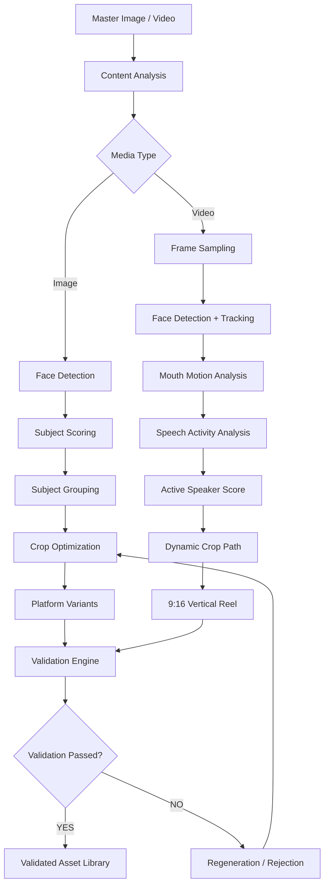

# 🎬 FrameForge AI

### Intelligent Media Reformatting & Reframing Engine

**PS4 — Creative Reformatting Engine**

# 🧠 Overview

**FrameForge AI** is an AI-assisted creative media reformatting engine designed to transform a single master image or video into multiple platform-ready formats.

Instead of performing simple center cropping or fixed vertical conversion, FrameForge analyzes the visual content and uses detected subjects, faces, temporal motion, speech activity, and platform specifications to generate intelligent media variants.

### The system supports:

- 🖼️ Image adaptation
- 🎯 Subject-aware smart cropping
- 👥 Multi-face subject grouping
- 🎥 Video-to-vertical reframing
- 🗣️ Active-speaker-aware framing
- 📱 9:16 vertical reel generation
- 🖼️ Best-still extraction
- ✅ Machine-readable validation
- 🔄 Single-variant regeneration
- 📚 Validated asset library management

---

# 🎯 Problem Statement

Modern content creators frequently need to transform one piece of master content into multiple platform-specific formats.

A single image or video may need to become:

| Format | Aspect Ratio | Typical Use |
|---|---:|---|
| Landscape | `16:9` | YouTube / Web |
| Square | `1:1` | Social feeds |
| Portrait | `4:5` | Social feed posts |
| Vertical | `9:16` | Reels / Shorts / Stories |

A naive solution simply resizes or center-crops the source.

That creates several problems:

- Important subjects can be cropped out.
- Faces may be partially cut.
- Multiple people may not fit inside the crop.
- Vertical videos can remain focused on the wrong person.
- Speaker changes can make the active speaker disappear.
- Extracted stills may be blurry or poorly framed.
- Assets may satisfy dimensions while still violating quality requirements.

FrameForge AI addresses these problems through **content-aware reframing and validation**.

---

## 🚀 Live Demo

### [▶ Launch FRAMEFORGE AI](https://atyasha-frameforge-ai.hf.space)

Experience the deployed application directly through the live Hugging Face Space.

---

# 💡 Solution

FrameForge AI introduces an intelligent media pipeline:



## Local setup

Use Python 3.11.9 locally.

```bash
python -m venv .venv
# Windows PowerShell
.\.venv\Scripts\Activate.ps1
# macOS/Linux
# source .venv/bin/activate

pip install -r requirements.txt
```

Install FFmpeg and make sure `ffmpeg -version` works in a terminal.

Run:

```bash
python app.py
```

Open `http://localhost:7860`.

### Provided challenge assets

- `demo/input_image.png` — supplied master image.
- `demo/input_video_sample.mp4` — 20-second demo clip extracted from the supplied 190-second source video so the public demo remains lightweight.

For the complete source video, select the original file from your local machine in the Video upload component.

## Architecture

```text
MASTER IMAGE
     │
     ▼
YuNet / Haar Face Detection
     │
     ▼
Subject Scoring + Subject Group
     │
     ▼
Crop Optimizer ──> 16:9 / 1:1 / 4:5 / 9:16
     │
     ▼
Validator ──> PASS ──> library/
     │
     └──────> FAIL ──> regenerate

MASTER VIDEO
     │
     ▼
Frame Sampling
     │
     ├── Face Detection + Tracking
     ├── Mouth-region Motion
     └── Audio Energy / Speech Activity
             │
             ▼
       Active Speaker Score
             │
             ▼
       Dynamic Crop Path
             │
             ▼
        Temporal Smoothing
             │
             ▼
          9:16 Reel
             │
             ▼
          Validator
             │
        PASS ─┴─> library/
```

## Third-party references

The implementation is original MVP code, but the design is informed by existing open-source reframing approaches. If you incorporate code from a third-party repository, preserve its license and attribution requirements.

YuNet is an OpenCV Zoo lightweight face detector; the application downloads its MIT-licensed model at first run and falls back to OpenCV Haar detection if the model cannot be downloaded.

## Important MVP scope note

The active-speaker module is intentionally lightweight. It does not claim biometric speaker identification. It uses temporal mouth motion, audio activity, face tracking, and face confidence to choose the active visual speaker. This is enough to demonstrate the PS4 mechanism without adding a large speaker-embedding/ASR stack.
